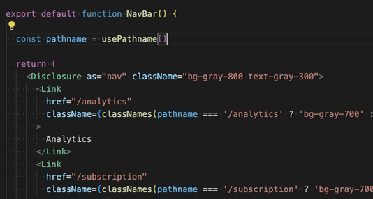

# planship-react

Welcome to `@planship/react`, the client-side SDK for [React](https://react.dev/) that enables entitlements, metering, plan packaging, and customer/subscription management in your React and [Next.js](https://nextjs.org/) apps powered by [Planship](https://planship.io). This SDK is built on top of the [@planship/fetch](https://github.com/planship/planship-js/tree/master/packages/fetch) JavaScript library and it uses the [React Context API](https://react.dev/learn/passing-data-deeply-with-context).

A complete working example of a Next.js app integrated with Planship can be found at https://github.com/planship/planship-nextjs-example

## The basics

The Planship React SDK implements two context providers:

- [`Planship`](#planship-context-provider) provider initialized with `withPlanshipProvider` and accessible via the `usePlanship` hook. This provider exposes an instance of the [Planship API client class](https://github.com/planship/planship-js/tree/master/packages/fetch/docs/interfaces/PlanshipApi.md).

- [`PlanshipCustomer`](#planshipcustomer-context-provider) provider initialized with `withPlanshipCustomerProvider` and accessible via the `usePlanshipCustomer` hook. This provider exposes an instance of the [Planship Customer API client class](https://github.com/planship/planship-js/tree/master/packages/fetch/docs/interfaces/PlanshipCustomerApi.md) initialized for a specific customer, as well as their `entitlements` that are continously updated via a WebSocket connection.

## Installation

Install `@planship/react` with npm, yarn or pnpm:

```sh
npm install @planship/react
# or
yarn add @planship/react
# or
pnpm add @planship/react
```

## Planship context provider

The `Planship` context provider is designed to be initialized at the very top of your layout where the Planship customer ID might not be known (E.g. outside of your authed layout).

With `@planship/react` added to your project, initialize `PlanshipProvider` using the `withPlanshipProvider` function, and wrap your components with it.

```js
import { withPlanshipProvider } from '@planship/react'

function App() {
  const PlanshipProvider = withPlanshipProvider(
    {
      slug: 'clicker-demo', // your Planship product slug
      getAccessToken: getAccessToken, // function that returns a valid Planship token
    }
  )

  return (
    <PlanshipProvider>
      <Page />
    </PlanshipProvider>
  )
}
```

Then, consume the `Planship` context in any of the nested components using the `usePlanship` hook:

```js
import { usePlanship } from '@planship/react'

export default function YourComponent({ children }) {
  const { planshipApiClient } = usePlanship()

  // Hook that provides the current user
  const user = useCurrentUser()

  // React state for Planship entitlements
  const [entitlements, setEntitlements ] = useState(() => ({}))

  // useEffect hook to retrieve entitlements from Planship via an API call
  useEffect(() => {
    async function fetchEntitlements(customerId: string) {
      planshipApiClient.getEntitlements(user.id)
      .then((e) => setEntitlements(e))
    }
    fetchEntitlements(user.id)
  }, [user])

  return (
    // Render some content using Planship customer entitlements
  )
}
```

## `PlanshipCustomer` context provider

The `PlanshipCustomer` context provider is designed to be initialized within a context where the Planship customer ID (typically your current user) is known, and it makes consuming customer level data like entitlements much easier.

With `@planship/react` added to your project, initialize `PlanshipCustomerProvider` using `withPlanshipCustomerProvider`, and wrap your components with it.

```js
import { withPlanshipCustomerProvider } from '@planship/react'

function App() {
  const user = getCurrentUser() //
  const PlanshipCustomerProvider = withPlanshipCustomerProvider(
    {
      slug: 'clicker-demo',           // Planship product slug
      customerId: user.id,            // Planship customer ID
      getAccessToken: getAccessToken, // function that returns a valid Planship token
    }
  )

  return (
    <PlanshipCustomerProvider>
      <Page />
    </PlanshipCustomerProvider>
  )
}
```

Then, consume the PlanshipCustomer context in any of the nested components:

```js
import { usePlanshipCustomer } from '@planship/react'

export default function YourComponent({ children }) {
  const { entitlements } = usePlanshipCustomer()

  return (
    // Render some content using Planship customer entitlements
  )
}
```

To fetch additional data from Planship, use an instance of the [Planship Customer API](https://github.com/planship/planship-js/blob/master/packages/fetch/docs/interfaces/PlanshipCustomerApi.md) client exposed by the `PlanshipCustomer` context. The example below shows how a list of customer subscriptions can be fetched from Planship.

```js
import { usePlanshipCustomer } from '@planship/react'

export default function SubscriptionInfoComponent({ children }) {
  const { planshipCustomerApiClient } = usePlanshipCustomer()

  // React state for Planship subscriptions
  const [subscriptions, setSubscriptions ] = useState(() => [])

  // useEffect hook to retrieve subscriptions via the Planship API
  useEffect(() => {
    async function fetchSubscriptions() {
      // No customer ID is required in PlanshipCustomer API client calls
      planshipCustomerApiClient.listSubscriptions().then((s) => setSubscriptions(s))
    }

    fetchSubscriptions()
  }, [planshipCustomerApiClient])

  return (
    // Render a list of Planship customer subscriptions
  )
}
```

### Typed entitlements with PlanshipCustomer context provider

When working with the entitlements dictionary returned by the `usePlanshipCustomer` hook, it can be useful to wrap it in an object with getters for individual levers.

```js
import { usePlanshipCustomer, EntitlementsBase } from '@planship/react'

class Entitlements extends EntitlementsBase {
  get apiCallsPerMonth(): number {
    return this.entitlementsDict?.['api-calls-per-month'].valueOf()
  }

  get advancedAnalytics(): boolean {
    return this.entitlementsDict?.['advanced-analytics']
  }
}

export default function YourComponent({ children }) {
  const { entitlements } = usePlanshipCustomer<Entitlements>(Entitlements)

  // entitlements object is an instance of the Entitlements class
  // with apiCallsPerMonth and advancedAnalytics properties

  if (advancedAnalytics.advancedAnalytics) {
    // do something if advancedAnalytics are enabled
  }
}
```

This is especially advantageous in IDEs like VS Code where it enables autocomplete for `entitlements`.



## Using Planship providers in a Next.js app

By default, all components in a Next.js app are React Server Components. React Server Components don't allow for consuming React context *directly*, so Planship context providers cannot by used *as is*. To address this, simply wrap them in your own Client Component as outlined in [this official guide](https://vercel.com/guides/react-context-state-management-nextjs#rendering-third-party-context-providers-in-server-components).

```js
'use client'

import { withPlanshipCustomerProvider } from '@planship/react'

export default function PlanshipProvider({
  children,
}: {
  children: React.ReactNode
}) {
  const PlanshipCustomerProvider = withPlanshipCustomerProvider(
    {
      slug: 'clicker-demo',           // Planship product slug
      getAccessToken: getAccessToken, // function that returns a Planship access token
    },
  )

  // current user context provided by CurrentUserProvider
  const currentUser = useCurrentUser()

  return (
    <PlanshipCustomerProvider customerId={currentUser.id}>
      {children}
    </PlanshipCustomerProvider>
  )
}
```

Then, you can use the new `PlanshipCustomerProvider` component in your Next.js app, E.g. in your root layout.

```js
export default async function RootLayout({
  children,
}: {
  children: React.ReactNode;
}) {
  return (
    <html>
      <body>
        <CurrentUserProvider>
          <PlanshipProvider>
            {children}
          </PlanshipProvider>
        </CurrentUserProvider>
      </body>
    </html>
  );
}
```

This pattern can be explored in more detail in our Next.js example app at https://github.com/planship/planship-nextjs-example

## Links

- [Planship Next.js example app](https://github.com/planship/planship-nextjs-example)
- [@planship/fetch library at the NPM Registry](https://www.npmjs.com/package/@planship/fetch)
- [Planship documentation](https://docs.planship.io)
- [Planship console](https://app.planship.io)
